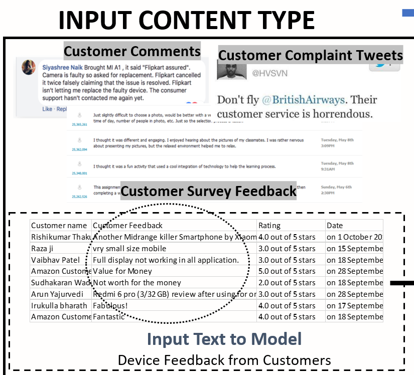

# smriti-singh-IntentExtraction
Intent Extraction for Voice of Customer using Natural Language Processing

## PROBLEM DOMAIN
Voice of Customer from sources like Customer Feedbacks, Comments, Survey Feedback contain a dynamic view of customer needs, problems, opinions, sentiments, inclinations, and propensities that change from time to time. 
Realizing the importance of this corpus of customer textual resources, enterprises can utilize signals from these to improve:
*performance in terms of quality, 
*operational efficiency, and revenue. 

## APPROACH TO SOLVE
The idea is to recognize concrete action items from voice of customers from millions of textual comments and feedback.

### Implementation:
*My solution involves a Python-NLP engine to parse the huge corpus of textual customer feedback, segment into feedback related to a specific product/service. 
*From each of these groups of feedback, the engine uses Microsoft Cognitive Services to categories the comments into Negative and Positive Feedback using the Text Sentiment Analyzer Engine. 
*The next step is to find the most concerning problem, common to most customers. The main intent of the customer is first extracted from each comment, reducing the size of text using Microsoft Cognitive Language Understanding Model (LUIS) for main intent extraction. 
*The next step after reducing the text is to cluster the similar customer concerns together. For this, Document2Vec Neural Network Model is used to cluster the similar intents together. 
*Finally, the result is then visualized to view top 5 customer concerns from millions of customer feedback.	

## WIDE APPLICATIONS OF SOLUTION

The result from the Engine built can be consumed as Actionable Insights for a domain, can be used for Trend Analysis of Popularity among Customers overtime, as an important signal channel for Service/Product Improvement.

(For more details, please see the powerpoint. For implementation, please see the python code, output is shown in the powerpoint, code to generate is mentioned.)
